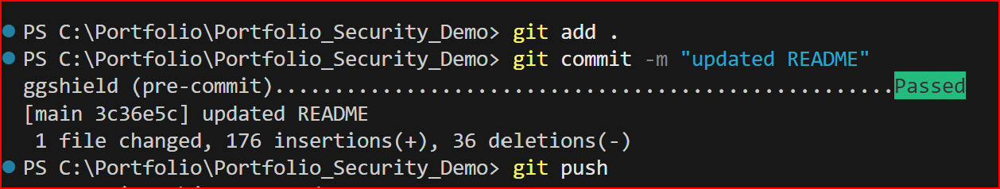

# Portfolio Repository (Sample)


This repository demonstrates reproducible security hygiene for portfolio preparation. All files here are placeholders; actual content is not exposed.

---

## 📖 Overview

This project is a demonstration of how to automatically check for "secrets" (like passwords or API keys) in a codebase. It uses a tool called `ggshield` to prevent sensitive information from being accidentally shared.

The main goals are:
- **Automate security:** Automatically scan for secrets before they are committed and pushed to a shared repository.
- **Ensure transparency:** Provide a clear and reproducible security workflow.
- **Promote best practices:** Showcase a professional approach to security and code management.

---

## 🏛️ Architecture & Workflow Diagram

The following diagram illustrates the complete security workflow, from local development to the remote repository.

```mermaid
graph TD
    subgraph Local Environment
        A[Developer writes code] --> B{git commit};
        B --> C{"pre-commit hook (ggshield)"};
        C --> D{Secret found?};
        D -- Yes --> E[Commit BLOCKED];
        D -- No --> F[Commit successful];
    end

    subgraph Remote Environment (GitHub)
        G[Developer pushes to GitHub] --> H{"GitHub Actions (CI/CD)"};
        H --> I{ggshield scan};
        I --> J{Secret found?};
        J -- Yes --> K[Workflow FAILS];
        J -- No --> L[Workflow succeeds];
    end

    F --> G;
```

This diagram shows the two layers of protection:
1.  **Local:** The `pre-commit` hook prevents secrets from ever entering your local repository history.
2.  **Remote:** GitHub Actions provides a second layer of defense, scanning all code that is pushed to the shared repository.

---


## 🎯 Purpose

This workflow ensures:

- ✅ Transparent and reproducible security practices
- ✅ Verification that no sensitive information is committed
- ✅ Audit-ready structure aligned with public sector trust requirements
- ✅ Educational reusability for reproducible DevOps and security training
- ✅ CI/CD-integrated validation for continuous assurance
- ✅ Local developer enforcement via pre-commit hooks

---

## ✨ Best Practices in Action

This project doesn't just state that it follows best practices; it demonstrates them. Here's how:

### 1. Defense in Depth
Security is applied in multiple layers to provide robust protection:
- **Layer 1 (Local):** The `pre-commit` hook acts as the first line of defense, preventing secrets from being committed on the developer's machine.
- **Layer 2 (Remote):** If a secret slips past the local checks, GitHub Actions provides a second layer of scanning on the remote repository, ensuring nothing is missed.

### 2. Shift-Left Security
By using `pre-commit` hooks, we "shift security to the left" in the development lifecycle. This means we catch potential issues at the earliest possible stage (during development) rather than later in production, which saves time and reduces risk.

### 3. Automation
All security scans are automated. This removes the potential for human error (e.g., forgetting to run a scan) and ensures that security checks are consistently applied for every change.

### 4. Reproducibility and Transparency
The entire security workflow is defined as code (`.pre-commit-config.yaml`, `.github/workflows/secret-scan.yml`). This makes the process:
- **Transparent:** Anyone can see exactly how the security checks are configured.
- **Reproducible:** Any developer can set up the exact same security workflow with minimal effort.

---

## Setup

This project uses `ggshield` and `pre-commit` to prevent secrets from being committed to the repository. The following steps will guide you through the setup process.

### 1. Python Virtual Environment

It is recommended to use a Python virtual environment to isolate the project's dependencies from your system. The `venv-ggshield` directory in this repository is a placeholder for this purpose.

To create and activate a virtual environment, run the following commands:

```bash
# Create a new virtual environment named "venv-ggshield"
python3 -m venv venv-ggshield

# Activate the virtual environment
# On Windows
venv-ggshield\Scripts\activate
# On macOS and Linux
source venv-ggshield/bin/activate
```

### 2. Install Dependencies

Once the virtual environment is activated, install the necessary tools using pip (Python's package installer):

```bash
# Install ggshield and pre-commit
pip install ggshield pre-commit
```

### 3. Install Pre-commit Hooks

Install the pre-commit hooks defined in `.pre-commit-config.yaml`. This will enable `ggshield` to run automatically before each commit.

```bash
# Install the pre-commit hooks
pre-commit install
```

---

## 🔒 Security & Reproducibility Workflow

This repository is validated through automated and reproducible steps:

1.  **Initial Setup:**
    -   Created sample files (`cv_sample.txt`, `coverletter_sample.txt`, `notes.txt`)
    -   Initialized Git repository using `git init`
    -   Staged and committed files with `git add .` and `git commit`

2.  **Local Scanning (Manual):**
    -   You can manually run a scan on the entire repository at any time:
        ```bash
        ggshield secret scan repo .
        ```
    -   Confirmed result: **No secrets have been found**

3.  **Automated Local Scanning (Pre-commit):**
    -   The pre-commit hook automatically scans any changes you try to commit.
    -   If a secret is detected, the commit is blocked, preventing it from being saved to your local repository.

    **Example of a successful commit:**

    Here is a screenshot showing the `ggshield` pre-commit hook successfully scanning for secrets before a commit.

    

4.  **Automated Remote Scanning (CI/CD):**
    -   The GitHub Actions workflow (`.github/workflows/secret-scan.yml`) automatically scans the code on every push and pull request to the remote repository on GitHub.
    -   A nightly scan is also scheduled for continuous monitoring.

---

## 📝 Notes

- This repository is designed for demonstration and documentation purposes.
- File contents are intentionally minimal and non-sensitive.
- The workflow is portable across any Git-tracked project folder.
- GitHub Actions configuration is located in `.github/workflows/secret-scan.yml`
- Pre-commit configuration is located in `.pre-commit-config.yaml`

---

## 📎 Related Tools

- [ggshield](https://github.com/GitGuardian/ggshield) — A command-line tool for detecting secrets in source code.
- [GitHub Actions](https://docs.github.com/en/actions) — An automation platform for CI/CD (Continuous Integration/Continuous Deployment).
- [pre-commit](https://pre-commit.com/) — A framework for managing and maintaining multi-language pre-commit hooks.

---

## 🌐 API Connectivity Notes

- `ggshield` normally verifies scans via the GitGuardian API.
- If the API is unreachable due to network restrictions, you can use local scanning:
  ```bash
  ggshield secret scan path .
  ```

---

## ☁️ Cloud Environment Notes

This workflow has been tested in environments with restricted connectivity.

### Key points

- `ggshield` scans remain reproducible even when API calls are blocked.
- Local scanning ensures security validation without external dependencies.
- `.gitignore` prevents environment-specific artifacts from being committed.
- The workflow is portable across cloud environments (Google, Azure, AWS).

---

## 💡 Challenges & Learnings

This project, while a demonstration, mirrors real-world software development challenges. Here are some of the key learnings from building this security workflow.

### 1. Challenge: Environment Inconsistency
- **Problem:** Initial attempts to run setup commands failed because the necessary tools (like `docker` or `pip`) were not available in every environment. This is a classic "it works on my machine" problem, which is a major source of friction in team projects.
- **Solution:** We addressed this by creating very explicit setup instructions in the `README.md`. By guiding the user to create a Python virtual environment (`venv`) and install dependencies into it, we ensure a consistent and reproducible environment for anyone working on the project. This is a fundamental best practice for collaborative development.

### 2. Challenge: Communicating Complex Technical Concepts
- **Problem:** The initial documentation was technically accurate but difficult for a wider audience (including non-developers or new developers) to understand. The "why" behind the workflow was not clear.
- **Solution:** We iteratively improved the `README.md` to make it more accessible without sacrificing technical detail. We achieved this by:
    1.  Adding a high-level **"Overview"** to explain the project's purpose in simple terms.
    2.  Creating a **Mermaid diagram** to provide a clear visual map of the workflow.
    3.  Adding a **"Best Practices in Action"** section to explain the reasoning and benefits behind our technical choices.
    This process highlighted the importance of clear communication in technical documentation.

### 3. Challenge: Maintaining Professionalism and Quality
- **Problem:** An unintentional error led to a foreign language (Korean) appearing in the documentation. This small error could undermine the professional appearance of the project.
- **Solution:** The issue was promptly identified and corrected. This served as a good reminder that attention to detail is crucial. Just as we automate scans for secrets in code, we must also be diligent in proofreading and reviewing our documentation to maintain a high standard of quality.

---

